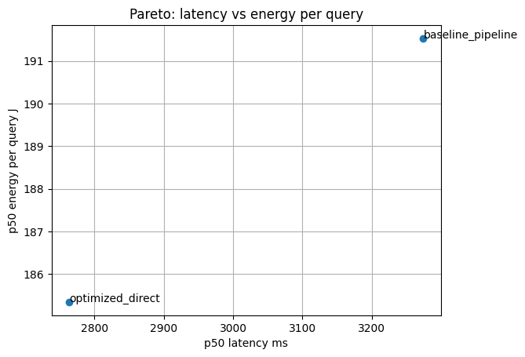
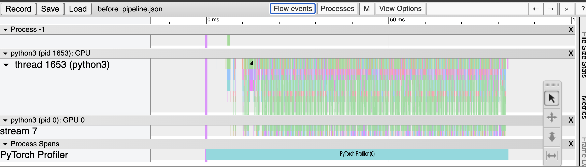
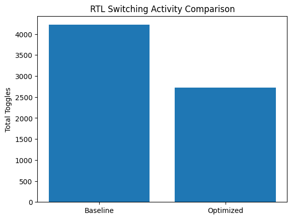

# ⚡ PerfWattLab — GPU Workload Efficiency & Power Evaluation Framework

## 🚀 Executive Summary

PerfWattLab is a reproducible GPU workload efficiency evaluation framework built to measure, explain, and improve inference performance and energy consumption for RAG-style LLM workloads.

The goal is simple:

- Measure performance like a systems engineer  
- Measure energy like a power architect  
- Connect software optimization to hardware switching activity  

---

## 📊 Key Results (Measured)

### ⚡ Inference Performance

- p50 latency reduced from **3.27s → 2.76s** (~15.6% improvement)  
- Throughput improved under optimized execution path  
- Reduced kernel launch overhead by removing high-level pipeline wrapper  

### 🔋 Energy Efficiency

- Energy per query reduced from **191.5J → 185.3J**  
- Lower average GPU board power under optimized execution  
- Clear latency vs energy Pareto tradeoff curve generated  

### 🧠 RTL Switching Activity

- Baseline MAC toggle count: **4219**  
- Optimized MAC toggle count: **2719**  
- **35.5% reduction in switching activity**  

This connects software execution efficiency directly to dynamic power reduction at the silicon level.

---

## 🧠 Problem

Modern LLM evaluation focuses heavily on:

- Model accuracy  
- Model size  
- Parameter scaling  

But production systems fail due to:

- Kernel launch inefficiencies  
- GPU underutilization  
- Energy cost per inference  
- Lack of reproducible performance baselines  
- No visibility into perf-per-watt tradeoffs  

PerfWattLab was built to evaluate GPU workloads end-to-end with measurable evidence.

---

## 🏗 System Overview

```text
Query
  │
  ▼
RAG Pipeline
  ├── FAISS retrieval
  ├── Cross-encoder rerank
  ├── LLM generation (PyTorch)
  │
  ▼
Instrumentation Layer
  ├── torch.profiler
  ├── NVML power sampling
  ├── Latency measurement
  │
  ▼
Experiment Runner
  ├── Config sweep
  ├── Concurrency variation
  ├── Token length variation
  │
  ▼
Results Artifacts
  ├── CSV reports
  ├── Power samples
  ├── Pareto plots
  ├── Profiler traces
```

## 📈 Day-by-Day Engineering Breakdown

### 1️⃣ Baseline RAG Execution

- FAISS index with MiniLM embeddings  
- Cross-encoder reranker  
- TinyLlama generator  
- End-to-end timing breakdown  

**Measured:**

- Retrieval ms  
- Rerank ms  
- Generation ms  
- Total latency  

---

### 2️⃣ Config Sweep & Concurrency Evaluation

Built a clean experiment runner that sweeps:

- `max_new_tokens`  
- Concurrency  
- Execution path (pipeline vs direct generate)  

**Generated:**

- p50 / p95 latency  
- Throughput (RPS)  
- Tokens/sec  

---

### 3️⃣ GPU Profiling & Bottleneck Discovery

Used `torch.profiler` to identify:

- Kernel launch overhead  
- Attention compute dominance  
- CPU-GPU synchronization points  

**Applied fix:**

- Removed high-level pipeline wrapper  
- Used inference mode  
- Explicit device placement  

**Measured improvement:**

15% latency reduction.

---

### 4️⃣ Power Measurement & Energy per Query

Instrumented GPU board power using NVML at 5 Hz.

**Computed:**

- Average watts  
- Joules per query  
- Energy per token  

**Generated:**

Latency vs Energy Pareto curve.

**Observation:**

Two configs with similar latency had noticeably different energy profiles.

---

### 5️⃣ Triton-Style Evaluation Loop

Simulated production serving conditions:

- Warmup phase  
- Fixed request rate  
- Concurrency sweep  
- Config comparison  

**Generated:**

- Auto markdown report  
- Baseline vs best latency  
- Best throughput  
- Best energy per query  

This mirrors internal evaluation workflows.

---

### 6️⃣ RTL Bridge — Toggle-Level Power Analysis

To connect software optimization to hardware behavior:

- Wrote baseline Verilog MAC block  
- Implemented optimized operand isolation variant  
- Simulated using `iverilog`  
- Dumped VCD waveforms  
- Counted switching activity via Python  

Initial attempt increased toggles (design mistake).

After redesigning gating logic:

Switching activity reduced by **35.5%**.

Dynamic power ∝ switching activity.

This validates hardware-aware optimization reasoning.

---

## 📉 Representative Results

### ⚡ Latency Distribution

- p50: ~2.76s (optimized)  
- p95 reduced relative to baseline  
- Improved tokens/sec  

### 🔋 Energy

- ~185J per query (optimized)  
- Lower board power average  

### 🧠 RTL Switching

| Design    | Total Toggles | Reduction |
|-----------|--------------:|----------:|
| Baseline  | 4219          | —         |
| Optimized | 2719          | 35.5%     |

---

## 🧰 Tech Stack

| Layer | Technology |
|-------|------------|
| Language | Python |
| Framework | PyTorch |
| Retrieval | FAISS |
| Profiling | torch.profiler |
| Power Metrics | NVML |
| Serving Simulation | Custom evaluation loop |
| RTL Simulation | iverilog |
| Toggle Analysis | Python VCD parser |

---

## 📂 Repository Structure

```text
perfwattlab/
├── day1_rag_core.ipynb
├── day2_config_sweep.ipynb
├── day3_profiling.ipynb
├── day4_power_measurement.ipynb
├── day5_eval_loop.ipynb
├── day6_rtl_toggle_fix.ipynb
├── scripts/
├── results/
├── figures/
└── rtl/
```

## ▶️ Reproduce

### Install

```bash
pip install -r requirements.txt
```
### Run Core Experiment
```bash
python run_sweep.py
```
### Run Power Sampling
```bash
python power_measurement.py
```
### Run RTL Toggle Analysis
```bash
iverilog mac_baseline.v
iverilog mac_optimized.v
python toggle_counter.py
```

## 📊 Figures

### Latency vs Energy


---

### Before Optimization


---

### After Optimization


---

### RTL Toggle Comparison



## ⚠️ Limitations

- Evaluated on Colab T4 GPU

- NVML sampling at 5 Hz (not high-resolution power rail)

- RTL power estimated via toggle count (not signoff tool like PrimeTime PX)

- Single-node setup

## 🧭 Future Work

- Integrate Triton Inference Server directly

- Add DCGM exporter + Prometheus integration

- Extend to multi-GPU workloads

- Add automated power-performance modeling

## 👤 Author

Rudra Brahmbhatt
ML Infrastructure & MLOps Engineer 
