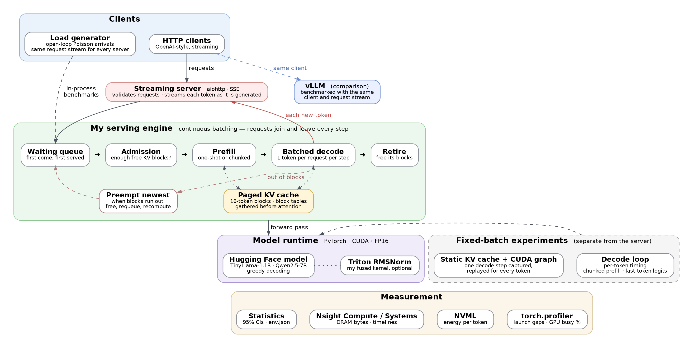
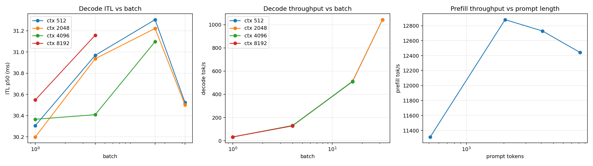
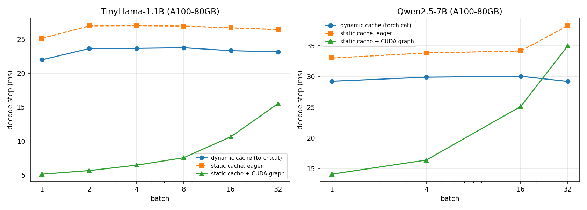
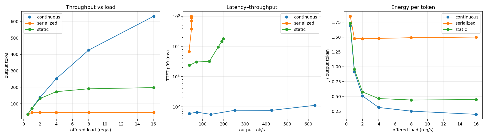
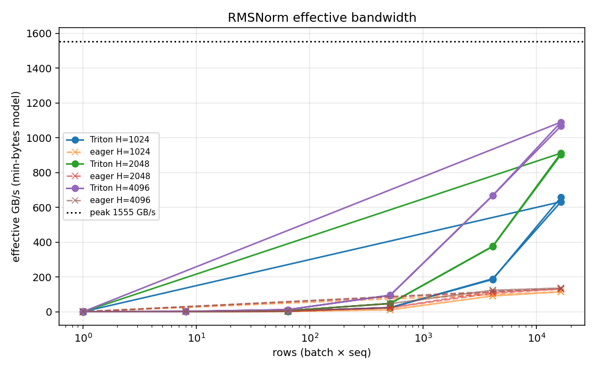
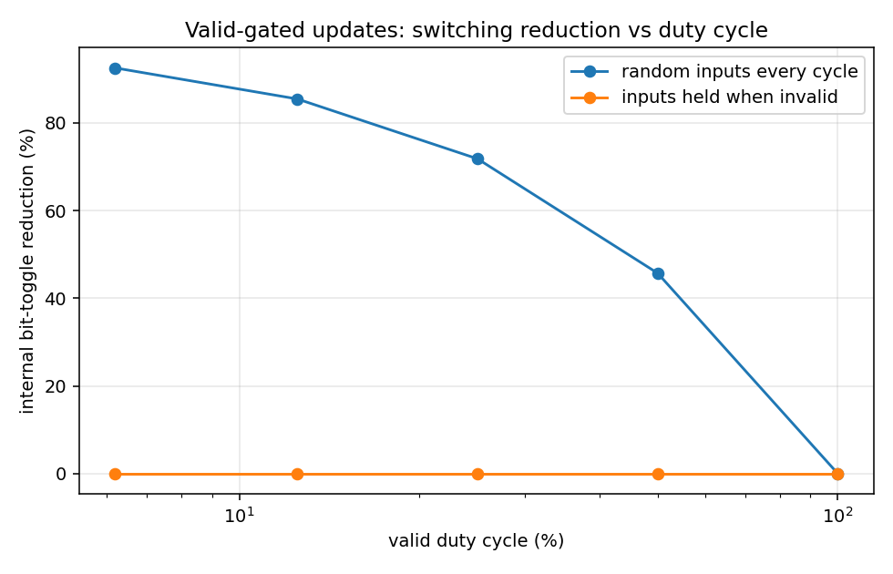

# PerfWattLab — Where Do the Time and Energy Go When a GPU Serves an LLM?

PerfWattLab is my hands-on project for learning LLM inference performance engineering. I built a small inference engine from scratch (an explicit prefill/decode loop, a paged KV-cache allocator, a continuous batching scheduler, and a streaming HTTP server), wrote a custom Triton kernel, profiled everything with PyTorch and NVIDIA Nsight tools, and compared my engine against vLLM on the same GPU.

Every number in this README comes from a CSV in `results/`. Every result folder also has an `env.json` with the GPU, driver, clocks and library versions that produced it.

---

## Why this project exists (and what I got wrong the first time)

The first version of PerfWattLab (v1) was a GPU power/latency benchmark for a small RAG pipeline on a T4. It measured real things, but the README claimed more than the code could back up. In an interview for an AI performance engineering role, I was asked questions like *"show me the exact synchronization you removed"*, *"where is your scheduler?"* and *"what did your kernel actually change?"* I didn't have good answers, because I hadn't gone below the framework level.

So I rebuilt the project around one rule: **every claim needs a measurement, a hypothesis, hardware evidence, and a stated tradeoff.** Below is what I found, including the places where my first explanation turned out to be wrong.

---

## Key results

| What I found | Evidence |
|---|---|
| My v1 "16% speedup" was **not** a synchronization fix. The whole gain came from `torch.inference_mode()` vs the pipeline's `torch.no_grad()`. | Pipeline vs direct-with-`no_grad`: +0.1% (no difference). Swapping only the grad mode: **−10.1%** ms/token. Sync API counts identical (264 vs 265). |
| Batch-1 decode through Hugging Face is **launch-bound**, not memory-bound. | GPU busy only **15–28%** of the time, confirmed by three separate tools (torch.profiler, Nsight Systems, Nsight Compute). ~950 kernel launches per token. |
| My bandwidth model is right at batch 1, but hardware counters found what it missed at batch 32. | Measured DRAM traffic within **1.2%** (TinyLlama) and **3.5%** (Qwen-7B) of my model at batch 1. At batch 32 the GPU moves **2.4×** more than modeled: **45% of all memory traffic is `torch.cat` copying the KV cache** to append one token. |
| Decode latency barely changes with batch size. | TinyLlama step time 21.5 → 23.0 ms from batch 1 → 32, while throughput rises **30×**. |
| Prefill is compute-bound. | Qwen-7B prefill reaches **172–214 TFLOP/s**, up to 68% of the A100's FP16 peak. |
| My continuous batching scheduler vs a one-at-a-time server. | **14.1× throughput [95% CI 13.0–15.4]**, ~1,000× lower time to first token, **8.5× less energy per token** (TinyLlama, 16 requests/s, 3 independent workloads). 7.4× throughput on Qwen-7B. |
| Paged KV cache fits far more requests. | **5.4×** more concurrent sequences than reserving max length per request (98% vs 19% memory utilization). |
| My Triton RMSNorm kernel. | 8 kernels → 1. Nsight Compute: eager moves **8.8× the necessary bytes**; my kernel runs at **99% of achievable bandwidth**. 8× faster than eager at large sizes, −5 to −10% decode time end to end. |
| Why Qwen-7B prefill ran out of memory. | Two wrong guesses first (logits alone; attention score matrices). Confirmed cause: prefill memory grows **linearly with tokens per forward pass** (65k tokens → 22.5 GiB, 131k → 45.0 GiB). Last-token logits halve it; **chunked prefill cuts it by 74–78%** at the failing sizes, for a 6–25% TTFT cost. |
| **CUDA graphs** (implemented in my decode loop). | Batch-1 decode step **22.0 → 5.1 ms (4.3×)**, energy per token **−57%**, tokens identical to eager. The gain shrinks as batch grows (1.5× at 32) and **reverses** for Qwen-7B at batch 32. |
| **In-place KV cache** (Hugging Face `StaticCache`) — **backfired**. | It removed the `torch.cat` copies (3,193 → 8 MB) but made each step move **2.3× more** memory (7.2 → 16.3 GB): with a mask present, Hugging Face copies K/V 8× to expand grouped-query heads. Eager decode got 14% slower. |
| **Chunked prefill in my scheduler** — **made things worse**. | TTFT p50 45 → 370 ms and throughput −4 to −21%, with no ITL improvement. For TinyLlama a whole prompt prefills faster than one decode step, so there was no stall to smooth. |
| vs vLLM, same GPU, same HTTP client. | At 16 requests/s: **626 vs 1,132 tok/s** and **41.6 vs 2.8 ms** per token. My engine uses **less energy per token than vLLM at every rate up to 8 requests/s**. The gap is per-step execution, not scheduling. |
| Energy follows GPU utilization. | 1.50 J/token (one-at-a-time) → 0.197 (my batching) → **0.027** (vLLM at full load): **55×**. |

---

## 1. Hardware and setup

| GPU | Used for |
|---|---|
| **NVIDIA A100-SXM4-40GB** (1,555 GB/s datasheet bandwidth; **1,390 GB/s** measured achievable) | Experiments 0–4, all Nsight profiling, KV-pressure test, vLLM offline |
| **NVIDIA A100-SXM4-80GB** (2,039 GB/s datasheet bandwidth; **1,765 GB/s** measured achievable) | Serving error bars, the HTTP-to-HTTP comparison with vLLM, the CUDA-graph experiments, the prefill memory test and chunked prefill in the scheduler |

Colab assigned me a different A100 in a later session. I never compare numbers across the two GPUs; every table says which one it came from.

**Models:** TinyLlama-1.1B-Chat and Qwen2.5-7B-Instruct, FP16, greedy decoding.
**Software:** torch 2.11 / CUDA 12.8, transformers 5.16, Triton 3.6. vLLM 0.30 (with torch 2.13).
**v1** was measured on a T4, and I only use it for re-analyzing the old results.

---

## Tech stack

| Area | Technologies |
|---|---|
| Languages | Python, OpenAI Triton (GPU kernel language), Verilog |
| Model runtime | PyTorch (CUDA, SDPA / FlashAttention, `torch.compile`, CUDA graphs), Hugging Face Transformers |
| Models | TinyLlama-1.1B-Chat, Qwen2.5-7B-Instruct (FP16) |
| Serving | My own engine (continuous batching, paged KV cache), aiohttp (OpenAI-compatible streaming server), vLLM (comparison) |
| Profiling | torch.profiler, NVIDIA Nsight Compute, NVIDIA Nsight Systems, NVTX |
| Power and energy | NVML (`nvidia-ml-py`: hardware energy counter, power, clocks) |
| Retrieval (RAG) | FAISS, sentence-transformers |
| Analysis and testing | NumPy, pandas, matplotlib, bootstrap statistics, pytest |
| Hardware and tools | NVIDIA A100 (40 GB and 80 GB), Google Colab, CUDA 12.8; iverilog and Yosys for RTL |

---

## Architecture

<p align="center">
  
</p>

The diagram is generated from `figures/architecture.dot` (Graphviz), so it can be regenerated when the code changes.

**How a request flows:** a request arrives (from the load generator or over HTTP) and waits in the queue. The scheduler admits it only if there are enough free KV-cache blocks and prefill budget. It is prefilled (all at once, or in chunks), then joins the batch that decodes one token per step. Each new token is streamed back to its client right away. When a request finishes, its blocks are freed. If memory runs out mid-generation, the newest request is paused, its blocks are freed, and it's recomputed later.

**The main pieces:**

| Component | File | What it does |
|---|---|---|
| Load generator | `engine/loadgen.py` | Creates the same random request stream for every server, so comparisons are fair |
| Streaming server | `engine/server.py`, `serve_engine.py` | OpenAI-compatible API; streams each token as soon as it exists |
| Scheduler | `engine/scheduler.py` | Continuous batching (plus serialized and static baselines): admission, prefill, decode, preemption |
| Paged KV cache | `engine/kv_cache.py` | 16-token blocks handed out on demand; copies ("gathers") a request's blocks together before attention |
| Fixed-batch decode loop | `engine/generate_loop.py` | Times prefill and every token separately; supports chunked prefill and last-token logits |
| Static cache + CUDA graphs | `engine/static_decode.py` | Preallocated KV cache; one decode step captured as a CUDA graph and replayed per token |
| Custom kernel | `kernels/rmsnorm_triton.py` | Fused Triton RMSNorm that can be swapped into the model |
| vLLM runner | `backends/vllm_runner.py` | Benchmarks vLLM with the same client and the same request stream |
| RAG pipeline | `pipeline.py` | FAISS retrieval + reranking + generation (used to re-test the v1 result) |
| Measurement | `profiler.py`, `nsight_targets.py`, `energy.py`, `stats.py`, `env.py` | Timing, kernel traces, DRAM counters, energy, confidence intervals, and a record of the hardware |

The RTL experiment (`rtl/`) is separate from all of this.

---

## 2. What I corrected from v1

I'm keeping this list instead of quietly deleting the old claims, because figuring out *why* they were wrong taught me the most.

| What v1 claimed | What was actually true |
|---|---|
| "CPU-GPU synchronization at the pipeline boundary was the problem." | **Wrong, and now disproven.** Both paths make the same number of synchronization calls. The speedup came from `inference_mode` vs `no_grad`. |
| "Cut p50 latency 16% across 1,000+ runs." | It was 30 runs per config. The pooled 16% isn't statistically significant (95% CI 0.36–1.92) and was partly because one prompt generated fewer tokens. Compared prompt by prompt, the real effect is **−10.7%** (CI 0.87–0.92). |
| "Energy per query −3.2%." | Not significant (energy per token CI 0.96–1.03). |
| "I added micro-batching." | v1 never had batching. Real batching is Experiment 3. |
| "Concurrency sweep simulating production serving." | v1's load test ran every request behind a lock, so the GPU only ever saw one request. It also started the latency timer late, hiding queueing time. Fixed and renamed. |
| "Benchmarked against TensorRT-LLM and Triton-style baselines." | Never implemented. Removed. v2 compares against one real engine: vLLM. |
| "Profiled with Nsight Systems." | Not in v1. It is now. |
| "Implemented clock gating" (RTL). | It's register enables, not clock gating. |
| "This connects the Python optimization to the silicon." | It doesn't; the RTL experiment is separate. |
| "Switching activity −35.5%." | The count included clock and testbench signals, counted bus changes instead of bit flips, and **my v1 MAC design had a bug**. Fixed and re-measured. |

---

## 3. How I worked

For every optimization I write down six things:

```
Observation → Hypothesis → Evidence → Change → Result (with 95% CI) → Tradeoff
```

The last one matters: I've learned that performance changes are rarely free.

**Rules I followed so the numbers are fair:**
- Warmup runs are thrown away.
- When comparing configs, I run them **interleaved in random order**, not all of A then all of B. (v1 did A-then-B, which I tested separately in Experiment 0.)
- Output length is **fixed**, so no config wins just by generating fewer tokens.
- I report **bootstrap 95% confidence intervals**. If the interval includes "no change", I say there's no significant change.
- Energy comes from the GPU's **hardware energy counter** (NVML), not from sampling power a few times per second. Idle power is measured separately.
- Latency is measured from when a request was **scheduled to arrive**, so queueing time is never hidden.
- Correctness comes first: 52 tests check that my engine produces **exactly the same tokens as Hugging Face `generate()`**, including when requests are preempted and recomputed, with chunked prefill, and with a real CUDA graph replayed on the GPU.

---

## 4. Experiment 0 — Where did the v1 speedup come from?

**Question:** v1 replaced the Hugging Face `pipeline()` with a direct `model.generate()` call and got faster. Why?

**Setup:** TinyLlama, 20 prompts, fixed 128-token outputs, 60 runs per variant, all interleaved. I tested three variants:

| Variant | How it generates | Grad mode |
|---|---|---|
| `pipeline` | `transformers.pipeline(...)` | `no_grad` (what the pipeline uses internally) |
| `direct` | `model.generate()` | `inference_mode` |
| `direct_no_grad` | `model.generate()` | `no_grad` |

### Results (A100-40GB)

| Comparison | ms per token (paired) | Verdict |
|---|---|---|
| pipeline → direct | **−9.4%** (CI 0.904–0.908) | faster |
| direct_no_grad → direct (only the grad mode changes) | **−10.1%** (CI 0.896–0.902) | faster |
| pipeline → direct_no_grad | +0.1% (CI 0.998–1.005) | **no difference** |

So the pipeline wrapper itself costs nothing. The whole gain is `inference_mode`.

### Checking my other guesses

| Hypothesis | Result |
|---|---|
| H1: `inference_mode` skips autograd bookkeeping per operation | ✅ **Confirmed**: −10.1% on its own |
| H2: The pipeline's pre/post-processing adds time | ❌ Only 0.9 ms + 0.3 ms out of 3,315 ms |
| H3: The paths pass different generation settings | ❌ The settings differ, but pipeline and `direct_no_grad` run at the same speed |
| H4: v1's run order (A then B) biased the result | ❌ Blocked order: −9.2%; interleaved: −9.3% |

### Why a grad-mode flag changes speed by 10%

I analyzed the torch.profiler traces:

| | pipeline | direct | direct_no_grad |
|---|---|---|---|
| GPU busy | 14.0% | 15.5% | 14.3% |
| Kernel launches per token | 948 | 956 | 956 |
| Median gap between kernels | 26.0 µs | **24.1 µs** | 25.8 µs |
| Total idle-gap time (128 tokens) | 4,655 ms | **4,136 ms** | 4,548 ms |
| `cudaStreamSynchronize` calls | 265 | 264 | 264 |

The GPU is idle about 85% of the time, waiting for the CPU to launch the next of ~950 tiny kernels per token. `inference_mode` launches the **same kernels**, but the CPU skips some bookkeeping for each one, so each launch reaches the GPU a bit sooner. The shorter gaps add up to the entire time saved. The sync counts are identical, which rules out my v1 explanation.

For reference, TinyLlama's weights (2.2 GB) at 1,555 GB/s give a minimum decode time of ~1.4 ms per token. The measured 23.4 ms is **16.5× slower than that floor**.

**Energy:** energy per token dropped 7.6%, but energy *above idle* didn't change. The saving comes from finishing sooner while the GPU draws its idle power, not from doing less work.

```
Observation : decode at 23–26 ms/token, 16–18× above the bandwidth floor; GPU busy 14–16%
Hypothesis  : the CPU launching ~950 kernels per token is the bottleneck; inference_mode makes each launch cheaper
Evidence    : same kernels, same sync counts; median launch gap 25.8 → 24.1 µs; H2–H4 rejected
Change      : generate under torch.inference_mode() instead of torch.no_grad()
Result      : −10.1% ms/token (CI 0.896–0.902, 60 runs per variant)
Tradeoff    : none in speed; tensors created this way can't be used for training later
```

---

## 5. Experiment 1 — Prefill vs decode

v1 only measured total generation time, but prefill and decode stress the GPU very differently. I wrote my own generation loop (`engine/generate_loop.py`) so I could time each phase and every single token separately.

### 5.1 Decode: latency stays flat, throughput scales

**TinyLlama, prompt 128, 128 output tokens (A100-40GB):**

| Batch | Time per step | Tokens/s | Memory bandwidth used | GPU util | J / token |
|---|---|---|---|---|---|
| 1 | 21.5 ms | 46 | 6.6% | 31% | 1.51 |
| 4 | 23.7 ms | 169 | 6.0% | 32% | 0.40 |
| 16 | 23.0 ms | 693 | 6.3% | 33% | 0.11 |
| 32 | 23.0 ms | **1,394** | 6.5% | 33% | **0.068** |

**Qwen2.5-7B, prompt 512, 128 output tokens:**

| Batch | Time per step | Tokens/s | Memory bandwidth used | GPU util | J / token |
|---|---|---|---|---|---|
| 1 | 30.3 ms | 33 | 32% | 55% | 4.68 |
| 4 | 31.0 ms | 129 | 32% | 57% | 1.29 |
| 16 | 31.3 ms | 510 | 32% | 64% | 0.44 |
| 32 | 30.5 ms | **1,044** | 34% | 67% | **0.29** |

Running 32 sequences costs about the same per step as running 1, so throughput goes up ~30× and energy per token drops ~20×. Even the 7B model at batch 1 runs 3.1× slower than its memory-bandwidth floor (~9.8 ms). The smaller the model, the more the CPU overhead dominates.



### 5.2 Prefill: compute-bound

| Model | Prefill tokens/s | Compute achieved |
|---|---|---|
| TinyLlama | 5,000 (1×128) → 70,500 (32×512) | 11 → 155 TFLOP/s |
| Qwen-7B | 11,300 → 14,000 | **172 → 214 TFLOP/s** (up to 68% of peak) |

Once a few thousand tokens are in flight, prefill saturates the GPU's tensor cores.

### 5.3 My predictions vs what happened

| I predicted | Result |
|---|---|
| Prefill throughput rises until compute saturates | ✅ Qwen plateaus at ~12–14k tok/s |
| Decode step time stays flat from batch 1 to 8 | ✅ Stays flat all the way to 32 |
| Decode gets slower as context grows (more KV cache to read) | ❌ **Didn't happen.** Qwen batch 1: 30.3 ms at 512 tokens, 30.5 ms at 8,192. The per-step overhead hides the extra memory reads. |

I also filled in the rest of the sweep (TinyLlama at 1,536 tokens, Qwen with 32 and 256 output tokens). No surprises: step time stays flat and throughput scales with batch.

### 5.4 Out-of-memory errors: my first explanation was wrong

Qwen-7B ran out of memory at 4,096×32, 8,192×16 and 8,192×32, even though the KV cache at 4,096×32 is only ~7.8 GB.

**My first hypothesis:** the prefill computes logits for *every* prompt position (batch × prompt × 152k vocabulary, about 40 GB at exactly those points), but only the last position is needed. I added a `--last-token-logits` option and ran before/after in the same session:

| Qwen-7B | TTFT, all logits | TTFT, last token only | Change |
|---|---|---|---|
| 512 × 1 | 44.3 ms | 43.0 ms | −3% |
| 512 × 32 | 1,170 ms | 1,102 ms | −6% |
| 2,048 × 32 | 5,311 ms | 4,541 ms | **−15%** |
| 4,096 × 16 | 5,448 ms | 4,669 ms | **−14%** |
| 8,192 × 4 | 2,589 ms | 2,450 ms | −5% |
| 4,096×32, 8,192×16, 8,192×32 | OOM | **still OOM** | — |

The speed part of my prediction held: prefill got up to 17% faster, for free. But **the memory part was wrong**: the same three points still ran out of memory.

**My second hypothesis was also wrong.** I thought attention was building its full score matrix. When I went back to the Nsight Compute kernel list, prefill **did** use the fused FlashAttention kernel (`flash_fwd_kernel`, one call per layer). The "extra matrix multiplies" I had pointed to were just the normal projection layers (7 per layer). Lesson: read the kernel names before building a story on kernel counts.

**Third hypothesis — confirmed:** prefill memory scales with the **total tokens in one forward pass** (batch × prompt), not with prompt length. Qwen's MLP is 18,944 wide, so at 131k tokens each MLP intermediate tensor is ~5 GB, and several exist at once. I measured peak memory above the weights on the A100-80GB, where these configs fit (`run_attention_check.py`):

| Qwen-7B prefill | Tokens per forward pass | All logits | Last-token logits | Chunked (1,024) + last-token | TTFT cost of chunking |
|---|---|---|---|---|---|
| 4 × 2,048 | 8,192 | 2.8 GiB | 1.5 GiB | 1.0 GiB | +19% |
| 16 × 4,096 | 65,536 | 22.5 GiB | 12.2 GiB | 5.8 GiB | +13% |
| 32 × 2,048 | 65,536 | 22.5 GiB | 12.2 GiB | 7.9 GiB | +6% |
| 32 × 4,096 | 131,072 | 45.0 GiB | 24.4 GiB | **11.5 GiB** | +6% |
| 16 × 8,192 | 131,072 | 45.0 GiB | 24.4 GiB | **9.7 GiB** | +17% |
| 32 × 8,192 | 262,144 | **OOM even on 80 GB** | 48.9 GiB | 19.4 GiB | +25% |

- **16×4,096 and 32×2,048 use exactly the same memory** (same token count, different prompt lengths). Attention scales with prompt length squared, so it can't be the cause. Doubling the tokens doubles the memory (22.5 → 45.0 GiB).
- The profile on this exact code path confirms prefill uses **FlashAttention** (one `flash_fwd_kernel` per layer).
- **My first hypothesis wasn't entirely wrong, just incomplete:** logits were about **half** of prefill memory. Removing them saves 10–20 GiB, but on the 40 GB card 24.4 GiB + 15.2 GiB of weights still didn't fit.
- **Chunking fixes it:** memory drops a further 35–60% below last-token alone (−74% to −78% vs full logits at the 131k-token points), for a 6–25% slower prefill. By this data, 32×4,096 chunked (~11.5 + 15.2 GiB) should fit on the 40 GB card; I haven't run that there.

```
Observation : Qwen-7B OOMs at 3 points on 40 GB even though their KV cache is small
Hypothesis  : 1) full logits (rejected alone)  2) attention score matrices (rejected: FlashAttention)
              3) activation memory scales with tokens per forward pass
Evidence    : same tokens → same memory regardless of prompt length; 2× tokens → 2× memory;
              logits = ~half of it
Change      : last-token-only logits + chunked prefill (1,024-token chunks)
Result      : peak prefill memory 45.0 → 11.5 GiB at 32×4,096 (−74%); the 80 GB card's only OOM
              (32×8,192) now runs at 19.4 GiB
Tradeoff    : prefill 6–25% slower (more, smaller passes, each re-reading the cache so far)
```

### 5.5 Checking my math with hardware counters

All the "memory bandwidth used" numbers above came from my own model: bytes the step *should* move, divided by time. I used **Nsight Compute** to read the GPU's actual DRAM counters for one step, and **Nsight Systems** to record a timeline. I also measured the real bandwidth ceiling with a 2 GB memory copy: **1,390 GB/s**.

**Decode steps:**

| Target | Kernels | Measured DRAM | My model | Measured ÷ model | Bandwidth while kernels run | GPU busy |
|---|---|---|---|---|---|---|
| TinyLlama, batch 1 | 969 | 2,196 MB | 2,223 MB | **0.99** | 353 GB/s (25%) | 28% |
| Qwen-7B, batch 1 | 1,423 | 14,807 MB | 15,349 MB | **0.96** | 815 GB/s (59%) | 59% |
| TinyLlama, batch 32 | 1,079 | 7,179 MB | 2,938 MB | **2.44** | 578 GB/s (42%) | 50% |

At batch 1 my model is correct within 4%. At batch 32 the GPU moves 2.4× more than I expected, so I looked at the per-kernel breakdown:

| TinyLlama, batch 32 | DRAM traffic | Share |
|---|---|---|
| `CatArrayBatchedCopy` (KV cache append via `torch.cat`) | 3,199 MB | **45%** |
| Weight matrix multiplies | ~2,700 MB | 38% |
| Attention (FlashAttention) | 1,061 MB | 15% |

**Nearly half the memory traffic is Hugging Face's cache copying itself to add one token.** The copying moves 3× more bytes than attention reads from the cache. It also explains why memory capacity is halved because the old and new copies exist at the same time.

**Prefill (TinyLlama, 8 × 512):** the GPU is 98% busy. Matrix multiplies are ~38% of the bytes, and **unfused small operations (RMSNorm pieces, SiLU, multiply, add, copies) are ~57%**. So kernel fusion matters even more for prefill than for decode.

**Nsight Systems** (whole decode loop): 130,339 kernel launches, and the GPU was busy **20%** of the time. That lines up with torch.profiler (15–25%) and Nsight Compute (28%). The tracing itself adds some overhead, so 20% is a lower bound.

### 5.6 CUDA graphs, and a static cache that backfired (A100-80GB)

The earlier experiments showed decode is launch-bound: ~950 kernel launches per step, GPU idle most of the time. A **CUDA graph** records all those launches once and replays them with a single call. It has one requirement: every step must use the **same tensor shapes and memory addresses**. Hugging Face's default cache grows with `torch.cat` every step (new shape, new address), so I first switched to its `StaticCache`: one preallocated buffer, new tokens written in place. Then I captured one decode step as a graph and replayed it for every token (`engine/static_decode.py`, `run_decode_opt.py`).

**Correctness:** a GPU test checks that graph replay gives exactly Hugging Face's greedy tokens, and in every run graph replay matched eager static decoding token for token (agreement 1.000). Static vs the original dynamic cache agreed on 93–100% of tokens: the two use different attention kernels, FP16 rounding differs slightly, and once one greedy token flips, the rest of that sequence diverges.

**Decode step time, prompt 512 (median of 3):**

| Batch | TinyLlama: dynamic | static | **static + graph** | Graph speedup | Qwen-7B: dynamic | static | **static + graph** | Graph speedup |
|---|---|---|---|---|---|---|---|---|
| 1 | 22.0 ms | 25.1 ms | **5.1 ms** | **4.3×** | 29.2 ms | 33.0 ms | **14.1 ms** | **2.1×** |
| 4 | 23.7 ms | 27.0 ms | 6.4 ms | 3.7× | 29.9 ms | 33.8 ms | 16.4 ms | 1.8× |
| 16 | 23.3 ms | 26.7 ms | 10.6 ms | 2.2× | 30.0 ms | 34.2 ms | 25.1 ms | 1.2× |
| 32 | 23.1 ms | 26.4 ms | 15.5 ms | 1.5× | 29.2 ms | 38.3 ms | 35.0 ms | **0.83× (slower)** |



- **At batch 1, graphs remove most of the overhead:** TinyLlama goes from 22.0 to 5.1 ms per token (45 → 165 tok/s) and energy per token drops 57% (1.98 → 0.86 J). vLLM decodes at about 2.5 ms on the same GPU, so the per-step gap shrinks from ~9× to ~2×.
- **Capturing costs ~30 ms per graph** (35–39 ms for Qwen), paid once per batch size.
- **But the static cache made eager decoding about 14% slower** (31% for Qwen at batch 32), and as batch grows that cost eats the graph gain. At Qwen batch 32 the graphed static path is 20% slower than where I started.

**Why the static cache backfired (Nsight Compute, TinyLlama, batch 32, one step):**

| DRAM traffic | Dynamic cache | Static cache |
|---|---|---|
| Cache-append copies (`torch.cat`) | 3,193 MB | **8 MB** ✅ |
| Elementwise ops / copies | 175 MB | **7,029 MB** ❌ |
| Attention | 1,060 MB (FlashAttention split-KV) | **6,517 MB** (memory-efficient kernel) ❌ |
| Weight matrix multiplies | 2,752 MB | 2,759 MB |
| **Total** | **7,180 MB** | **16,313 MB (2.3×)** |

The static cache did exactly what I built it for: the `torch.cat` copies went from 3.2 GB to 8 MB. But total traffic more than doubled. A static cache always needs an attention mask (to hide the unfilled slots), and in Hugging Face's code **grouped-query attention can only use PyTorch's fused path when there's no mask**. With a mask, it physically copies K and V from 4 heads to 32 heads every step: writing an 8× copy of the 761 MB cache (~6.1 GB) plus reading the original accounts for most of the ~7 GB. Then it runs a slower attention kernel over the expanded copies. The GPU was 92% busy during that step, but mostly moving data it didn't need.

So graphs work, but on top of a cache layout the attention kernel can't read efficiently. The real fix is an attention kernel that understands grouped-query heads *and* a static or paged cache without copying; that's what vLLM's paged-attention kernel does.

**Batch-size buckets.** A graph is captured for one batch size. To serve 17 requests with only 24- or 32-size graphs, you pad with dummy rows:

| TinyLlama (Qwen similar) | Step time | Useful tokens/s | Energy per useful token |
|---|---|---|---|
| Batch 17, exact 17-graph | 10.8 ms | 1,496 | 0.18–0.19 J |
| Padded into 24-graph (29% dummy rows) | 12.7 ms (+18%) | 1,279 (−15%) | +22–30% |
| Padded into 32-graph (47% dummy rows) | 15.5 ms (+44%) | 1,061 (−29%) | +62–73% |

Coarse buckets waste real compute and energy, so real systems capture many graph sizes. vLLM's startup log in my Colab session showed it capturing 53 (that log isn't saved in `results/`).

*Not measured correctly:* graph memory. My counter (`torch.cuda.memory_allocated`) doesn't see a graph's private memory pool, so it reported ~0.

```
Observation : batch-1 decode spends most of each 22 ms step launching ~950 kernels (GPU busy 28–44%)
Hypothesis  : a CUDA graph can replay the whole step in one launch; that needs a fixed-address cache
Evidence    : Exp 0 launch gaps; Nsight busy fractions; graph replay reproduces eager tokens exactly
Change      : HF StaticCache (in-place writes) + one captured decode step replayed per token
Result      : TinyLlama batch 1: 22.0 → 5.1 ms (4.3×), −57% energy/token; Qwen-7B batch 1: 2.1×
Tradeoff    : the static cache makes attention copy K/V 8× (2.3× more DRAM traffic), so the gain
              fades with batch and Qwen-7B batch 32 gets 20% slower; ~30 ms capture per batch size;
              padding to a bucket costs up to 29% of useful throughput
```

---

## 6. Experiment 2 — The KV cache and my paged allocator

### 6.1 How big is the KV cache?

```
KV bytes per token = 2 (K and V) × layers × KV heads × head dimension × 2 bytes
```

| Model | KV bytes / token | Without grouped-query attention | Measured |
|---|---|---|---|
| TinyLlama (22 layers, 4 KV heads, dim 64) | 22,528 | 180,224 (8× more) | **exact match** |
| Qwen-7B (28 layers, 4 KV heads, dim 128) | 57,344 | 401,408 (7× more) | **exact match** |

### 6.2 Peak memory is about 2× the cache

I searched for the largest batch that could run a decode step before running out of memory, and compared it to how many sequences the KV cache alone should allow:

| Model, context | Expected from KV size | Measured max batch | Ratio |
|---|---|---|---|
| TinyLlama, 512 | 3,427 | 1,676 | 0.489 |
| TinyLlama, 1,024 | 1,713 | 844 | 0.493 |
| TinyLlama, 2,000 | 877 | 432 | 0.493 |
| Qwen-7B, 2,048 | 225 | 111 | 0.493 |
| Qwen-7B, 8,192 | 56 | 27 | 0.482 |

It's ~0.49 everywhere. Hugging Face appends a token by building a new, bigger copy of the cache, so for a moment both copies exist. The Nsight Compute measurements show the same copying from the memory-traffic side.

### 6.3 My paged allocator

Instead of reserving memory for the maximum length up front, my allocator (`engine/kv_cache.py`) gives each request 16-token blocks as it grows, tracked in a block table like `A → [2, 7, 11]`.

| Heavy-tailed request mix, TinyLlama | Reserve max length | Paged (16-token blocks) |
|---|---|---|
| Sequences that fit at once | 685 | **3,675 (5.4×)** |
| Memory actually used | 18.6% | **98.0%** |

**The honest limitation:** Hugging Face's attention needs one contiguous tensor, so before each step I copy ("gather") the blocks together. That gather costs 2–4% of step time for TinyLlama, up to **14%** for Qwen-7B at 8,192 tokens, and ~10–12% during serving. A real paged-attention kernel would read the blocks directly.

```
Observation : reserving max length wastes 81% of the KV memory
Hypothesis  : giving out 16-token blocks on demand removes the waste
Evidence    : measured cache bytes match my formula exactly on both models
Change      : block-table allocator with a free list, watermark and preemption
Result      : 5.4× more concurrent sequences; output still token-identical to Hugging Face
Tradeoff    : the gather copy costs 2–14% of step time; up to 15 empty slots per sequence
```

---

## 7. Experiment 3 — Continuous batching

v1's server handled one request at a time. I built three servers and replayed the **exact same** stream of requests (random arrivals, short prompts and outputs) against each:

- **Serialized:** one request at a time (v1's design).
- **Static batching:** wait for up to 8 requests, run them together until the longest finishes.
- **Continuous batching (mine):** every step, new requests can join and finished ones leave, using the paged KV cache. When memory runs out, the newest request is paused and recomputed later.

### 7.1 Results (TinyLlama, A100-40GB, one run per point)

| Requests/s | Server | Tokens/s | Requests meeting the SLO /s | TTFT p50 / p99 | TPOT p50 | Avg batch | J / token |
|---|---|---|---|---|---|---|---|
| 1 | serialized | 47 | 0.04 | 13,438 / 37,933 ms | 21.1 ms | 1.0 | 1.48 |
| 1 | static | 71 | 0.73 | 979 / 3,052 ms | 26.0 ms | 2.6 | 0.96 |
| 1 | **continuous** | 73 | **0.94** | **36 / 66 ms** | 29.1 ms | 2.3 | 0.92 |
| 4 | serialized | 47 | 0.02 | 41,088 / 86,764 ms | 21.2 ms | 1.0 | 1.48 |
| 4 | static | 173 | 0.46 | 4,010 / 9,518 ms | 26.3 ms | 7.1 | 0.46 |
| 4 | **continuous** | 252 | **3.27** | **40 / 76 ms** | 32.2 ms | 7.8 | 0.31 |
| 16 | serialized | 47 | 0.02 | 48,324 / 99,830 ms | 21.4 ms | 1.0 | 1.50 |
| 16 | static | 198 | 0.32 | 8,298 / 18,044 ms | 26.0 ms | 8.0 | 0.45 |
| 16 | **continuous** | **631** | **8.18** | **48 / 111 ms** | 40.8 ms | 23.1 | **0.197** |

The SLO is TTFT ≤ 2 s and TPOT ≤ 100 ms. Qwen-7B at 4 requests/s showed the same pattern: 33 → 238 tok/s and 4.77 → 0.77 J per token.



**What this shows:**
- The serialized server is stuck at **47 tok/s = 1 ÷ 21.3 ms** no matter the load. It can't beat one token per step. Requests just queue, and the worst one waited 125× longer than it would on an idle server.
- Static batching levels off near 200 tok/s, because each batch waits for its slowest request while new requests queue.
- Continuous batching keeps TTFT under 60 ms (median) at every load I tested.

### 7.2 The tradeoffs (predicted and measured)

| I predicted | What happened |
|---|---|
| Much higher throughput | ✅ ~14× (TinyLlama), ~7× (Qwen) |
| Each token gets slower, since steps are shared | ✅ TPOT 21 → 41 ms |
| New prompts cause latency spikes for running requests | ✅ ITL p99 89 ms vs a typical 41 ms |
| Under memory pressure, preemption keeps things running but hurts tail latency | ✅ With a 0.25 GB cache: 3 preemptions at 8 requests/s, TTFT p99 77 → 2,671 ms, while throughput still grew 194 → 326 → 419 tok/s |
| Energy per token drops with batching | ✅ 1.50 → 0.197 J |

Padding (short sequences padded to match long ones) wasted 7–30% of batch slots on the short mix and 40–48% on a heavy-tailed mix.

### 7.3 Error bars (A100-80GB, 3 independent workloads per rate)

The tables above are one run each, so I reran with three different random workloads per rate. Every server sees the same requests within a workload, so the ratios are paired:

| Continuous ÷ serialized (95% CI) | Throughput | TTFT p50 | TPOT p50 | Energy / token |
|---|---|---|---|---|
| TinyLlama, 1 req/s | 1.66× [1.37, 2.01] | ×0.0020 | 1.39× [1.36, 1.43] | ×0.58 [0.49, 0.69] |
| TinyLlama, 4 req/s | 5.74× [4.74, 6.95] | ×0.00092 | 1.52× [1.46, 1.59] | ×0.19 [0.16, 0.23] |
| TinyLlama, 16 req/s | **14.1× [13.0, 15.4]** | ×0.00095 | 1.88× [1.75, 2.03] | **×0.118 [0.110, 0.126]** |
| Qwen-7B, 1 req/s | 2.24× [1.84, 2.73] | ×0.0014 | 1.28× [1.25, 1.31] | ×0.42 [0.36, 0.48] |
| Qwen-7B, 4 req/s | **7.43× [6.54, 8.43]** | ×0.00087 | 1.47× [1.40, 1.55] | **×0.157 [0.144, 0.171]** |

The intervals are narrow, and the single-run numbers above are consistent with them.

```
Observation : the serialized server is stuck at 47 tok/s; TTFT reaches 48 s at 16 req/s;
              but a decode step costs about the same for 32 sequences as for 1
Hypothesis  : sharing each step across many requests multiplies throughput cheaply
Evidence    : step time flat vs batch; GPU only 15–28% busy
Change      : continuous batching over the paged KV cache
Result      : 14.1× throughput [13.0, 15.4], ~1,000× lower TTFT, 8.5× less energy per token
Tradeoff    : 1.88× slower per token; latency spikes when prompts join; gather costs ~10% of decode
```

### 7.4 Real token streaming

`serve_engine.py` puts my engine behind an OpenAI-compatible streaming API. One thread owns the GPU and runs the scheduler; each new token is sent to its client as soon as it exists. Tests check that tokens arrive one by one and match Hugging Face exactly, even with many requests at once.

Streaming over HTTP costs my engine only **0–4%** (at 16 requests/s: 650 → 626 tok/s, same 48 ms TTFT). That let me benchmark it against vLLM with the same client.

### 7.5 Chunked prefill in the scheduler — it made things worse

**My prediction:** when a long prompt joins, the running requests wait for its whole prefill, which causes the latency spikes measured earlier. Splitting prefill into 256-token chunks, one chunk per iteration, should smooth them.

I tested it on a long-prompt mix (512–1,536-token prompts), TinyLlama, A100-80GB, 3 workloads per rate. The chunked scheduler still matches Hugging Face token for token, including under preemption.

| Rate | Policy | Throughput | Goodput | TTFT p50 | TPOT p50 | ITL p99 |
|---|---|---|---|---|---|---|
| 2 req/s | continuous | 312 tok/s | 1.63 req/s | **45 ms** | 40 ms | 85 ms |
| 2 req/s | chunked | 300 tok/s | 1.56 req/s | 370 ms | 53 ms | 108 ms |
| 4 req/s | continuous | **416 tok/s** | **1.58 req/s** | **87 ms** | 56 ms | 139 ms |
| 4 req/s | chunked | 341 tok/s | 0.85 req/s | 2,408 ms | 73 ms | 153 ms |
| 8 req/s | continuous | **440 tok/s** | **1.15 req/s** | **1,656 ms** | 59 ms | 139 ms |
| 8 req/s | chunked | 349 tok/s | 0.38 req/s | 5,896 ms | 74 ms | 142 ms |

**Prediction rejected.** ITL p99 didn't improve at any rate, and everything else got worse. Two reasons:

1. **There was no long stall to smooth.** TinyLlama prefills a whole 1,536-token prompt in ~32 ms, less than one decode step at these batch sizes (40–60 ms). Those latency spikes come from something else, which I haven't isolated.
2. **My chunking runs each chunk as its own forward pass**, separate from the decode batch. A 1,536-token prompt now needs 6 iterations, each including a full decode step, before its first token. Real engines put chunk tokens *into the same forward pass* as the decode tokens.

Chunked prefill should pay off where one prefill costs many decode steps, e.g. Qwen-7B with an 8K prompt (~650 ms prefill ≈ 20+ decode steps). I didn't test that case.

---

## 8. Experiment 4 — A custom Triton RMSNorm kernel

> "Triton" here means **OpenAI Triton, the GPU kernel language**, not NVIDIA Triton Inference Server.

RMSNorm is `y = x / sqrt(mean(x²) + eps) * weight`. Hugging Face runs it as **8 separate kernels** (cast to FP32, square, mean, add, rsqrt, multiply, cast back, multiply by weight), each writing its result to memory and reading it back. My Triton kernel loads each row once, does everything in registers, and writes once.

### 8.1 Speed (FP16, A100-40GB)

| Hidden × rows | Eager | `torch.compile` | **My Triton kernel** | vs eager | vs compile |
|---|---|---|---|---|---|
| 2048 × 4,096 | 316 µs | 147 µs | **89 µs** | 3.5× | 1.6× |
| 2048 × 16,384 | 1,030 µs | 260 µs | **147 µs** | 7.0× | 1.8× |
| 4096 × 16,384 | 1,978 µs | 394 µs | **246 µs** | **8.0×** | 1.6× |

### 8.2 What the hardware counters say (Nsight Compute, 16,384 × 4,096)

| | Kernels | Memory moved | vs the 268 MB minimum | Bandwidth | % of achievable |
|---|---|---|---|---|---|
| Eager | 8 | 2,350 MB | **8.8×** | 1,240 GB/s | 89% |
| `torch.compile` | 1 | 251 MB | 0.94× | 1,390 GB/s | 100% |
| **My kernel** | 1 | 252 MB | 0.94× | 1,374 GB/s | **99%** |

This was the most useful result for understanding *why* fusion works:
- Each eager kernel is individually fast (89% of bandwidth). Eager is slow because together its kernels move **8.8× more data than necessary**. Fusion wins by moving ~9× fewer bytes, not by moving them faster.
- My kernel runs at the memory limit, but so does `torch.compile`'s. My 1.6× wall-clock advantage over `torch.compile` comes from lower CPU-side overhead, not better GPU work. I didn't expect that until I measured it.
- At decode size (1 row), the kernel keeps the GPU busy only 5% of its time; the rest is launch overhead.



### 8.3 Effect on the whole model

I measured decode time with eager RMSNorm, with my kernel, and with RMSNorm removed entirely. That last run gives wrong outputs, but it shows the most any RMSNorm optimization could possibly save.

| Batch | Eager | My kernel | No RMSNorm (upper bound) | My saving | Max possible |
|---|---|---|---|---|---|
| 1 | 27.1 ms | 24.5 ms | 18.7 ms | **−9.6%** | −31.2% |
| 8 | 29.5 ms | 26.8 ms | 20.7 ms | **−9.3%** | −29.8% |

RMSNorm takes 31% of decode time because its 360 kernel launches (45 calls × 8) are 39% of all launches, and in this launch-bound regime time follows launch count. My kernel captures about a third of the possible saving; the rest is Triton's own launch overhead. In a separate-process test the gain was −4.7% to −6.2%, so I'd honestly call it **5–10%**.

```
Observation : eager RMSNorm = 8 kernels × 45 calls = 360 of ~930 launches per token
Hypothesis  : fusing into 1 kernel saves launches (decode) and memory traffic (large inputs)
Evidence    : Nsight Compute — eager moves 8.8× the minimum bytes
Change      : single-pass Triton kernel, FP32 math in registers, tuned warps
Result      : 8× faster at large sizes, 99% of achievable bandwidth; 5–10% faster decode
Tradeoff    : one more kernel to maintain; needs a Volta-or-newer GPU; torch.compile's kernel is just as good on the GPU
```

---

## 9. Experiment 5 — My engine vs vLLM

Same model (TinyLlama, FP16), same forced output lengths, and the exact same request stream.

### 9.1 HTTP to HTTP, same GPU, same session (A100-80GB)

| Req/s | Mine: tok/s | vLLM: tok/s | Mine: TTFT | vLLM: TTFT | Mine: TPOT | vLLM: TPOT | Mine: J/token | vLLM: J/token |
|---|---|---|---|---|---|---|---|---|
| 0.5 | 37 | 38 | 35 ms | 18 ms | 28.6 ms | 2.5 ms | **1.98** | 2.33 |
| 1 | 73 | 75 | 40 ms | 18 ms | 29.5 ms | 2.5 ms | **1.07** | 1.41 |
| 2 | 138 | 150 | 42 ms | 17 ms | 30.9 ms | 2.5 ms | **0.59** | 0.88 |
| 4 | 251 | 299 | 42 ms | 17 ms | 32.6 ms | 2.5 ms | **0.35** | 0.56 |
| 8 | 423 | 587 | 47 ms | 17 ms | 36.8 ms | 2.6 ms | **0.26** | 0.34 |
| 16 | 626 | **1,132** | 48 ms | 18 ms | 41.6 ms | **2.8 ms** | 0.21 | **0.19** |

vLLM offline, with 1,024 requests at once (A100-40GB): **12,700 tok/s at 0.027 J/token**, 348 W average.

### 9.2 What I take from this

- **vLLM is 11–15× faster per token** (2.5–2.8 ms vs 29–42 ms). vLLM runs close to TinyLlama's 1.4 ms memory floor; mine is dominated by the ~930 kernel launches per step I measured earlier.
- **vLLM keeps up with every load I tested**, while mine starts falling behind the offered load from about 4 requests/s.
- **My scheduling works.** I reproduced most of the batching benefit, and my engine uses **less energy per token than vLLM up to 8 requests/s**. It only loses at 16, where it's saturated. I'm not sure why vLLM draws more power at low load; I didn't isolate it.
- **CUDA graphs close most of the batch-1 gap**: my step drops from 22 to 5.1 ms, against vLLM's ~2.5 ms. At higher batch, the static cache's K/V copying erases the gain, which is why vLLM also needs its own attention kernel.
- **Nsight showed me where the remaining gap is:** at batch 32 my step moves 2.4× the necessary bytes (45% is cache copying), and the GPU is idle half the time. vLLM avoids both with CUDA graphs (one launch per step instead of ~930) and a paged-attention kernel (no cache copying).

---

## 10. Energy

### 10.1 The energy ladder (TinyLlama, A100-40GB)

| Setup | J per output token | Improvement |
|---|---|---|
| One request at a time (v1's design) | 1.50 | 1× |
| + `inference_mode` (estimate from Experiment 0) | ~1.39 | 1.08× |
| My continuous batching, 16 req/s | 0.197 | 7.6× |
| vLLM server, 16 req/s | 0.168 | 8.9× |
| vLLM offline, full load | **0.027** | **55×** |

The biggest lesson: **energy per token depends on how busy the GPU is.** This A100 idles at ~55 W and draws only ~67 W during batch-1 decode. It's mostly waiting, but still paying for that waiting. Batching and removing launch overhead turn that fixed power into tokens. At full load vLLM draws 348 W and gets 55× more tokens per joule.

### 10.2 How I measured it

- NVML's **hardware energy counter**, read at the start and end of each measurement. v1 sampled power 5 times a second, which is too coarse for short runs.
- Idle power measured before each run, so I can report energy above idle separately.
- **One bug I caught:** my first vLLM offline number was 2.1 J/token, which would have meant ~19 kW. I had started the energy measurement before vLLM loaded the model. The physically impossible number is how I noticed.

---

## 11. Side experiment — RTL switching activity

> This is **separate from the GPU work**. It's a small hardware-design exercise from the v1 project, which I fixed and re-measured.

Two versions of a 3-stage multiply-accumulate circuit (`y = a*b + c`), simulated with iverilog:
- **Baseline:** every register loads new data every cycle.
- **Optimized:** registers only load when their data is valid, so the multiplier's inputs stay still on idle cycles (called *operand isolation*).

**Fixes from v1:**
- The v1 design had a bug: it added the *next* transaction's `c`. I fixed it and added a scoreboard that checks every result: **3,100 transactions, 0 mismatches**.
- It's **not clock gating**. The clock toggles the same in both designs (823 times), and the Yosys synthesis tool built it with 81 enable flip-flops, not clock-gating cells.

| Valid data rate | Inputs on idle cycles | Internal bit flips (baseline → optimized) | Reduction |
|---|---|---|---|
| 100% | random | 12,520 → 12,520 | 0% |
| 50% | random | 13,714 → 7,442 | −45.7% |
| 25% | random | 13,114 → 3,694 | **−71.8%** |
| 6.25% | random | 12,664 → 941 | −92.6% |
| 25% | **held steady** | 3,769 → 3,769 | **0%** |

The saving depends completely on the test inputs. If the inputs already stay steady on idle cycles, nothing switches in either design and the technique saves nothing. v1's test (random inputs every cycle) was the best possible case. Also, switching activity is only a proxy for power; I didn't do a real power analysis.



---

## 12. What I would do next

Ordered by how much the measurements say each would help:

| Next step | Why | Evidence |
|---|---|---|
| **A grouped-query-aware attention kernel for a static/paged cache** | Lets CUDA graphs keep their full gain at larger batch; removes the gather copy too | The static cache made attention copy K/V 8× (16.3 vs 7.2 GB per step); gather costs up to 14% |
| **CUDA graphs inside the serving scheduler**, with batch-size buckets | Brings the 2–4× decode speedup to real serving | 4.3× at batch 1 in the fixed loop; bucket padding costs up to 29% |
| **Chunked prefill mixed into the decode batch** (one forward pass) | My separate-pass version added iterations instead of removing stalls | It raised TTFT 45 → 370 ms and cut throughput up to 21% |
| **Test chunked prefill where prefill is long** (Qwen-7B, 8K prompts) | That's where one prefill costs many decode steps | ~650 ms Qwen-7B prefill vs ~30 ms decode steps |
| **More fused kernels** (SwiGLU, rotary) | Same idea as RMSNorm | Unfused small ops are 57% of prefill memory traffic |

Done since the first version of this list: CUDA graphs, in-place KV writes (backfired for a measured reason), the attention backend check (FlashAttention), and chunked prefill in both the fixed loop (fixed the out-of-memory errors) and the scheduler (made things worse).

---

## 13. Limitations

- **Hardware:** cloud-notebook A100s with unlocked clocks, and two different models (40 GB and 80 GB) across sessions. I only compare results measured on the same GPU. No H100 data.
- **CUDA graphs only run in my fixed-batch decode loop**, not in the serving scheduler, so the 4.3× speedup isn't in my server yet.
- **My engine is simpler than production ones:** greedy FP16 decoding only, no paged-attention kernel (blocks are copied together before attention), and chunked prefill runs as separate forward passes instead of being mixed into the decode batch.
- **Some measurements are thinner than others:** serving error bars come from 3 workloads per rate (the single-run tables have none), and Nsight Compute didn't profile Qwen-7B at batch 32.

---

## 14. What I learned

- **Measure before explaining.** My v1 explanation ("synchronization") sounded reasonable and was completely wrong. The real cause took one ablation to find.
- **Look at the GPU's idle time, not just its busy time.** For small-batch decode, the GPU is waiting 70–85% of the time. The fixes are about the CPU launching work, not about faster math.
- **My own performance model was right until it wasn't.** It matched the hardware within 4% at batch 1 and was off by 2.4× at batch 32. Only the hardware counters revealed the cache copying.
- **Fusion works by moving fewer bytes.** Eager RMSNorm's kernels were individually efficient; they just moved 8.8× more data than needed.
- **Energy per token is a utilization problem.** The same GPU gave 1.50 J/token or 0.027 J/token depending on how busy it was kept.
- **Fixing one cost can create a bigger one.** Switching to a static cache removed 3.2 GB of copies per step and added 12 GB of new traffic, because the attention path it forced couldn't handle grouped-query heads. I only saw this because I measured bytes, not just time.
- **Optimizations depend on the regime.** CUDA graphs were 4.3× faster at batch 1 and 20% slower for Qwen-7B at batch 32. Chunked prefill fixed memory in one place and hurt latency in another. A result without its batch size and model isn't a result.
- **Report the hypotheses that fail.** The logits fix made prefill faster but didn't fix the memory problem I built it for. My next guess (attention score matrices) was also wrong, and the kernel names in my own profile showed it. The third one (tokens per forward pass) held up, and it turned out the first one had been half right. Each wrong answer narrowed down the right one.

---

## 15. How to run it

```bash
pip install -r requirements.txt
python scripts/check_gpu.py        # which experiments this GPU can run
bash scripts/smoke_test.sh         # 52 tests (51 on CPU + 1 CUDA-graph test on GPU) + every runner on a tiny model
bash run_all.sh                    # all GPU experiments (A100: ~3 h)
```

Individual experiments:

```bash
python reanalyze_v1.py                                   # corrected v1 statistics (no GPU)
python run_exp0.py --repeats 3 --blocked --profile
python run_prefill_decode.py
python run_prefill_decode.py --model Qwen/Qwen2.5-7B-Instruct --last-token-logits --tag lastlogits
bash scripts/install_nsight.sh && python run_nsight.py
python run_attention_check.py --model Qwen/Qwen2.5-7B-Instruct   # prefill memory
python run_decode_opt.py                                 # CUDA graphs
python run_kv_cache.py
python run_serving.py --mix short --repeats 3
python run_serving.py --mix long --policies continuous,continuous_chunked --repeats 3
python run_rmsnorm.py --e2e
bash run_rtl.sh                                          # (needs iverilog)
```

vLLM goes last, because installing it replaces torch:

```bash
python serve_engine.py --port 8001 &                     # my engine over HTTP
python run_vllm.py server --base-url http://localhost:8001 --label perfwattlab_http --mix short
pip install vllm && pip uninstall -y torchaudio
vllm serve TinyLlama/TinyLlama-1.1B-Chat-v1.0 --dtype half --port 8000 &
python run_vllm.py server --mix short
python run_vllm.py compare --mix short
```

### Repository layout

```
perfwattlab/
├── pipeline.py          RAG pipeline + the three generation paths
├── profiler.py          torch.profiler + trace analysis (GPU busy %, launch gaps)
├── energy.py, power.py  NVML energy counter, idle subtraction, power sampling
├── stats.py             bootstrap confidence intervals, paired comparisons
├── engine/
│   ├── generate_loop.py prefill/decode loop with per-token timing (+ chunked prefill)
│   ├── static_decode.py static KV cache + CUDA graph capture/replay
│   ├── kv_cache.py      paged KV allocator
│   ├── scheduler.py     serialized / static / continuous batching
│   ├── server.py        OpenAI-compatible streaming server
│   └── loadgen.py       random request arrivals
├── kernels/             Triton RMSNorm
├── backends/            vLLM runner + HTTP benchmark client
├── nsight_targets.py    workloads for Nsight Compute
└── rtl/                 MAC designs, scoreboard testbench, toggle counter
run_*.py                 one script per experiment
tests/                   52 tests (exact match vs Hugging Face, allocator, kernel, server, chunked prefill, static cache, CUDA graphs)
results/                 v1 data (T4), v2 data (A100), RTL data
figures/                 plots used in this README
```

---

**Rudra Brahmbhatt**, MS Computer Science, Texas State University · [github.com/Rudra2122](https://github.com/Rudra2122)
